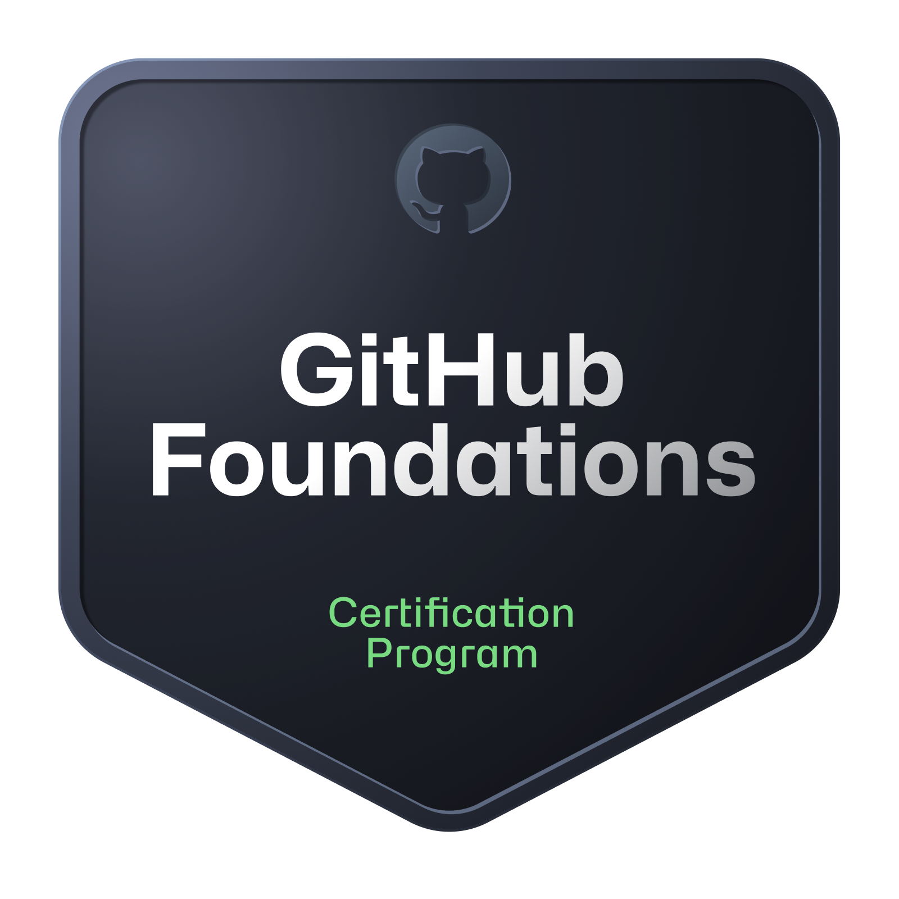

# Hi there! I'm Alejandro Barrientos Escalante 👋

## About Me

- **Age:** 21
- **Education:** Currently studying at Tecnológico Nacional de México, Campus Occidente del Estado de Hidalgo 📕

## GitHub Stats

## Top Languages

## Meet my own organizations

- **ESCALIA Corporation:** [ESCALIA Corporation](https://github.com/ESCALIA-Corporation)
- **CHILTIC-T:** [CHILTIC-T](https://github.com/CHILTIC-T)
- **Bionovaa:** [BIONOVAA](https://github.com/Bionovaa)

## Projects

I have several repositories showcasing my important projects:

- **E-commerce Project:** [View Repository](https://github.com/CHILTIC-T/website)
- **My Portfolio:** [View Repository](https://github.com/ESCALIA-Corporation/Website)
- **Python Flask Website with Docker:** [View Repository](https://github.com/ESCALIA-Corporation/python-website)
- **Academic Advisory Platform:** [View Repository](https://github.com/ESCALIA-Corporation/Plataforma-educativa)
- **Encryption Calculator with Flask:** [View Repository](https://github.com/beofalejandro/Calculadora-de-Encriptacion)

## Skills

I have experience in the following areas:

- SQL
- JavaScript
- Python
- IoT (Internet of Things)
- PHP
- Network Engineering
- HTML
- CSS
- Bootstrap
- Cloud Computing
- Docker
- Zabbix Monitoring
- Linux
- Arduino

## Let's Connect

Feel free to reach out if you want to collaborate on projects, have questions, or just want to connect!

## Credentials and Courses

- **Google Cloud Computing Foundations Certificate:**

<!---->

- **GitHub Foundations Certificate:**
<!---->

- **CISCO Network Security Certificate:**

--- 
Made with ❤️ by [Alejandro Barrientos Escalante](https://github.com/beofalejandro) and ESCALIA Corporation